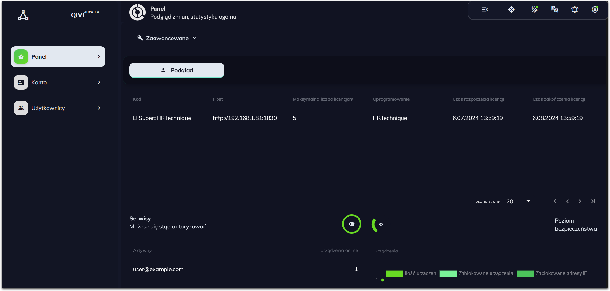
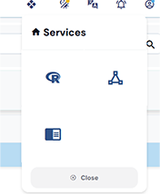
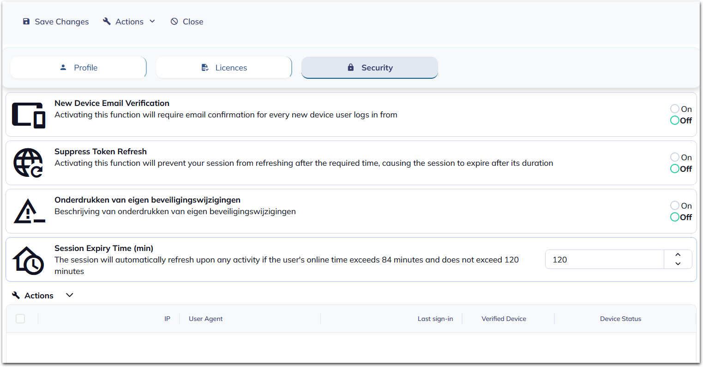
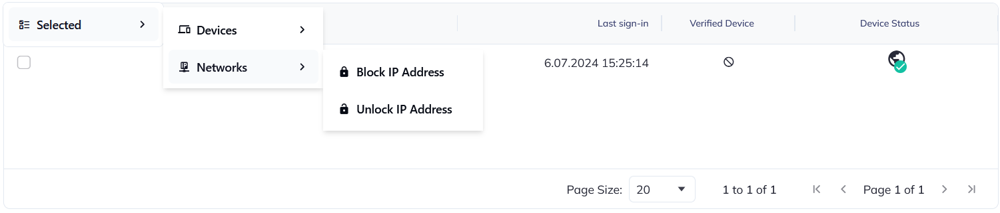

# QIVI (Qualified Integrated Verification Interface)
**Preview: http://46.41.151.95:1810/** 

email: trial@trial.com, password:trial 


## Table of Contents
- [Introduction](#introduction)
- [Authorization](#authorization)
- [Licensing](#licensing)
- [Hosting](#hosting)
- [User Management](#user-management)
- [Security](#security)
- [Setup and Deployment](#setup-and-deployment)

## Introduction

**QIVI** (Qualified Integrated Verification Interface) is an advanced authorization system developed by Web-Alchemy. It is an open-source project licensed under the MIT License, ensuring flexibility and wide adoption. Designed with SOLID principles in mind, QIVI aims to provide a robust and maintainable solution for accessing cloud services and managing security settings.

### Key Features and Benefits

- **Open-Source**: Licensed under the MIT License, allowing for widespread use and contribution.
- **SOLID Principles**: Developed with SOLID principles to ensure a robust, maintainable, and scalable system.
- **Independent Solution**: Operates autonomously, providing reliable authorization services.
- **Cloud Access**: Facilitates seamless access to cloud-based services.
- **Security Control**: Ensures fundamental security settings are managed effectively.

### Key Features

1. **Access Control**: Grants access to applications based on licenses, which can be acquired from the provider along with a dedicated server.
2. **Statistical Modules**: Offers modules for statistical analysis and data analysis from integrated systems.
3. **Version 1.0Beta**: The first systems trilogy (QIVI, Lombandit, and HRTechnique) will include advanced data analysis modules.

## Authorization

Authorization through the QIVI system provides a robust mechanism to limit access by unwanted devices, maintain their records, and allow configuration of various parameters. Key capabilities include:

- **Device Control**: Maintains a record of devices and enforces authorization.
- **Access Restrictions**: Allows configuration of access restrictions, network, and device locks.
- **Session Management**: Enforces the authorization of new devices, shortens active session times, and blocks session refresh.

### Benefits

- **Enhanced Security**: Protects resources from unauthorized access.
- **Centralized Management**: Manages multiple applications using a single QIVI account.
- **Ease of Use**: Simplifies control and administration across different businesses.

## Licensing

Licenses for QIVI are obtained in conjunction with the purchase of software or as an add-on to existing products. Key details include:

- **Dedicated Server**: Licenses are provided with a dedicated server, secured to ensure direct access only for the client via VPN.
- **Flexibility**: Licenses can be tailored to specific needs and scales.

## Hosting

QIVI may operate on cloud servers

- **Cloud Hosting**: Primary operation on secure cloud servers.
- **On-Premises Hosting**: Option to host services on physical servers at the client's location.

### Benefits

- **Reliability**: Ensures high availability and performance.
- **Adaptability**: Customizable to meet specific client requirements.

## User Management

The QIVI system provides comprehensive user management capabilities for administrators, who are typically the license owners. Key features include:

- **Privileges**: Administrators gain additional privileges and access to manage users.
- **Account Allocation**: Administrators can assign a specified number of accounts to employees based on the license size.

### Account Management Panel

- **Inspections and Configurations**: Conduct a range of security inspections and configurations.
- **Device Authorization**: Enforce authorization of new devices via email.
- **Session Management**: Shorten session times, disable session refresh, and block self-editing of settings.
- **License Assignment**: Assign existing licenses to other accounts.
- **User Data Management**: Edit users' personal data.


## Security

QIVI ensures a high level of security with various features aimed at protecting resources and managing access control:

- **New Device Authorization**: Enforces authorization of any new device trying to access the system via email.
- **Session Time Management**: Sets a maximum duration for user sessions, enhancing security.
- **Session Refresh Control**: Blocks automatic session refresh, forcing re-login after session ends.
- **Settings Management**: Blocks the ability for users to self-edit settings, ensuring only administrators can make changes.

### Security Features

1. **Enforcing New Device Authorization**: Ensures that only verified devices can access resources.
2. **Shortening Session Time**: Limits session duration to prevent unauthorized access.
3. **Disabling Session Refresh**: Adds an extra layer of security by requiring frequent re-login.
4. **Blocking Auto-Editing Settings**: Prevents unauthorized modifications to configurations.

## Setup and Deployment

To run the QIVI project, follow these steps:

### Frontend Setup
1. Navigate to `/AuthClient/` and `/HrTechniqueClient/`.
2. Ensure you have Node.js v20.10 installed.
3. Run the following commands:
   ```sh
   npm install
   npm run host
   ```
4. Adjust paths and ports in /variables/Urls as needed.

### Backend Setup
1. Rename **appsettings.Example.json** to **appsettings.json** in both /AuthServer/ and /HrTechniqueServer/ directories, and update it with your database credentials, email settings, passwords, etc.
2. Navigate to /AuthServer/ and /HrTechniqueServer/.
3. Ensure you have .NET 8 installed.
4. First, build the project by running the following command in the /ClassLibrary/ directory:
   ```sh
    dotnet build -c Release
   ```
5. Next, update the database in both /AuthServer/ and /HrTechniqueServer/.
Finally, start the servers.    
   ```sh
    dotnet run
   ```